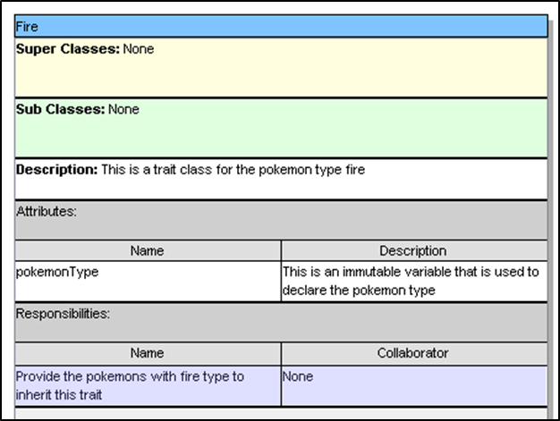

# Pokémon Scala (GUI)
As an exercise to demonstrate understanding of object-oriented programming, we recreated Pokémon from the ground-up with Scala.

# Screenshots

## Features

* **Visually appealing background and images** 

The application contains backgrounds and includes images and gifs to appeal to users and make the game more interactive and colorful. This gives the game more appeal and makes the game feel more complete as a result. The gifs in the game displays each Pokémon as an animated sprite, giving it the illusion that it is alive and providing aesthetic value to the game itself. Other than that, effects such as drop shadows, reflections, lighting and color inputs were also implemented in buttons and panes to aid in visual appeal as well.

*	**GUI elements**

Graphical User Interface is also present in the application, such as the implementation of buttons and bars which display the Pokémon’s hp, as well as each Players Pokémon. The hp bar in the game can change color from green to red depending on how much hp is left, which helps in simulating the actual game. Aside from that, each button and pane are also positioned accordingly based on the guidelines of proximity and contrast to ensure that the interface looks sleek and well-polished.

*	**Inclusion of sound FX**

The application created has sound which helps build tension in the game, as well as adding to the immersion of the game. The implementations of sound and music in the game also make it less bland and allows for a better feel of the application compared to if the app does not have any sound at all. For example, attack sounds and death sounds were also implemented to make the game feel more immersive and believable in a sense. The game will also play music at the Title screen, during the battle, and when a player win.

## Issues

*	**Limited features**

The application does not involve other features aside from starting the game, exiting the game, and choosing what to do during each player turn. Other functions that were not implemented in the application include letting players choose a name, using items and Pokémon selection is limited, along with several other functions that were excluded from the game.

* **Unbalanced mechanics**

Certain mechanics introduced in the game may or may not lead to unfairness due to the random selection of Pokémon. For instance, one player may get three water Pokémon and the other player may get three grass Pokémon, which is unfair since the later would win unconditionally with ease. This is also due to how the mechanics were coded, whereby the entire gameplay depends on the type weakness of the players Pokémon lineup.

*	**Application is not scalable**

One problem that the application faces is that the application and its components do not scale proportionately when the window is maximized, which can be jarring and make users lose interest in terms of how the application is developed.

# UML Class Diagram

# Class-Responsibility Collaborator (CRC)

